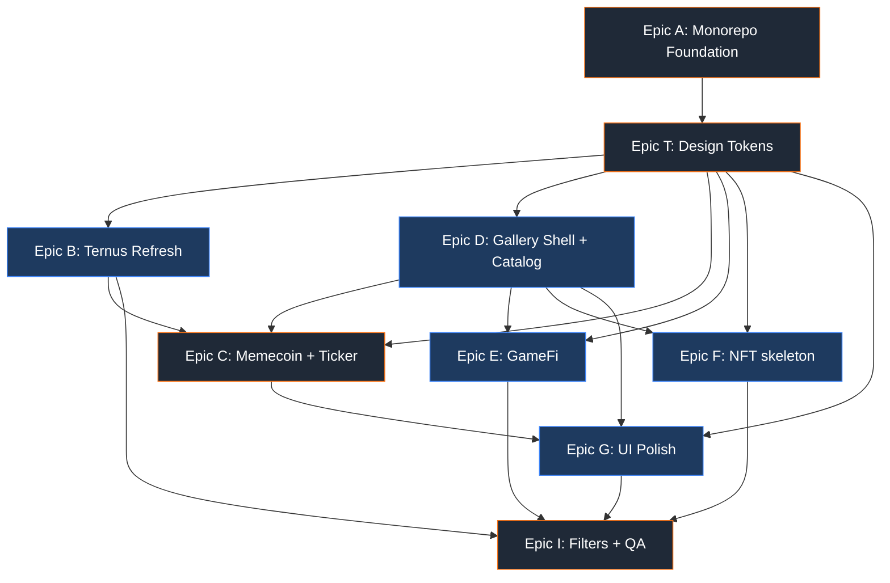

# Parallel Development Adjustment Strategy — landing-page-list

_Phiên bản: 2026-06-08 · Tác giả: planner/architect · Trạng thái: **ready-for-epics** (architecture patched, Epic G sau C confirmed)_

Tài liệu này điều chỉnh kế hoạch thực thi để nhiều AI agent chạy song song mà không đụng file. Đọc kèm:

- PRD: [prd.md](prds/prd-landing-page-list-2026-06-08/prd.md)
- Architecture: [architecture.md](architecture.md)
- Review blockers: [review-plan-reviewer.md](prds/prd-landing-page-list-2026-06-08/review-plan-reviewer.md)
- v20 Ternus port: [2026-06-07-ternus-v20-port.md](../../docs/plans/2026-06-07-ternus-v20-port.md)

---

## 1. Executive summary

PRD và architecture đã đủ chín để tạo epic, nhưng còn 5 blocker chặn việc chạy song song an toàn: (1) scaffold path còn mơ hồ giữa "greenfield rồi merge" và "in-repo `_legacy-src/`", (2) WIP v20 trên `src/templates/ternus` chưa commit nên migration có thể nuốt mất thay đổi, (3) format copy chưa phân biệt single-file (UI/section) vs multi-file (template), (4) thiếu bước rename `@repo/*` → `@landing/*` như một task tường minh, (5) `theme-nft` mới chỉ là open question chứ chưa có placeholder name để scaffold. Điều chỉnh cốt lõi: khoá toàn bộ quyết định nền tảng vào **một epic serial duy nhất (Epic A)** chạy bởi **một agent** trước khi mở song song; chia phần còn lại theo **ownership lane theo package path** để mỗi agent sở hữu một thư mục riêng, file dùng chung (catalog registry, `next.config`, `pnpm-workspace.yaml`) chỉ một agent được sửa qua cơ chế "registration PR" nối tiếp. Kết quả: 9 epic với 4 wave song song, tối đa 3 agent đồng thời, không có file collision trong cùng wave.

---

## 2. Architecture doc patches

Các mục cần sửa trực tiếp trong [architecture.md](architecture.md). Mỗi gạch đầu dòng là một quyết định để resolve blocker, kèm text đề xuất.

### Patch 1 — Resolve scaffold path ambiguity (blocker: scaffold ambiguity)

- Sửa mục **"Initialization Command"** và **"Selected Starter"**: bỏ phương án "scaffold ở thư mục cha rồi merge". Chốt **đúng một** quy trình in-repo:
    1. `git checkout -b chore/monorepo-migration`
    2. Gate-0 commit (xem Patch 4).
    3. `mkdir _legacy-src && git mv src/* _legacy-src/` (giữ git history thay vì `mv` trần).
    4. `corepack enable && corepack prepare pnpm@latest --activate`; xoá `package-lock.json`.
    5. `pnpm dlx create-turbo@latest . -m pnpm -e with-tailwind --skip-install` (scaffold vào root hiện tại).
    6. `pnpm install` tại root.
- Thêm câu chốt: "KHÔNG dùng greenfield-merge. Lý do: giữ git history của `src/`, tránh ambiguity về thư mục đích, và `_legacy-src/` là vùng chỉ-đọc sẽ bị xoá ở task cuối Epic A."

### Patch 2 — Tách bước rename `@repo/*` → `@landing/*` thành task tường minh (blocker: missing rename step)

- Trong mục **"Naming Patterns"**, bổ sung checklist sau `create-turbo`:
    - `packages/ui/package.json`: `"name": "@repo/ui"` → `"@landing/ui"`.
    - Tương tự cho mọi package: `@landing/design-tokens`, `@landing/sections`, `@landing/templates-<slug>` (lưu ý: tên npm không cho dấu `/` lồng — dùng `@landing/templates-ternus` chứ KHÔNG phải `@landing/templates/ternus`).
    - `apps/docs/package.json` deps: đổi mọi `"@repo/*": "workspace:*"` → `"@landing/*"`.
    - Sửa `tsconfig` base paths + `transpilePackages` trong `apps/docs/next.config.ts`.
    - Grep verify: `grep -rn "@repo/" .` → 0 kết quả (trừ `node_modules`, `_legacy-src`).
- Thêm cảnh báo: alias trong PRD ghi `@landing/templates/ternus` — đây là **import alias path** trong tsconfig, KHÁC với **npm package name** `@landing/templates-ternus`. Document cả hai để agent không nhầm.

### Patch 3 — Phân biệt copy format single-file vs multi-file (blocker: copy single vs multi)

- Sửa mục **"Copy source mechanism"** và **"Format Patterns → Copy output v1"**:
    - **UI piece** (`packages/ui/src/<name>/`): single-file copy — clipboard chứa nội dung `<name>.tsx` + header comment `// deps: <pkgs>`. Nếu có `.css` kèm, nối vào cuối trong cùng clipboard string, phân tách bằng `/* ---- <name>.css ---- */`.
    - **Section** (`packages/sections/src/<name>/`): single-file nếu 1 file; nếu >1 file, hiển thị **tabbed code viewer** (mỗi file 1 tab) + nút "copy file này", KHÔNG gộp clipboard.
    - **Template** (multi-file, vd Ternus 12+ file): KHÔNG single-file. Template detail page hiển thị **file tree + tab viewer** read-only, mỗi file có copy riêng, kèm 1 link "view source on repo". Copy toàn template = out of scope v1 (ghi rõ là non-goal v1).
    - Catalog metadata thêm field `copyMode: "single" | "multi"` để gallery render đúng UI.

### Patch 4 — Gate-0 WIP commit (blocker: v20 WIP before migrate)

- Thêm mục mới **"Gate-0: WIP reconciliation"** ngay trước Initialization Command:
    - File đang dirty: `src/components/pixel-blast/PixelBlast.tsx`, `src/templates/ternus/components/{hero-crystal,ternus-hero}.tsx`, `src/templates/ternus/ternus.css`, và untracked `src/templates/ternus/components/ternus-netstrip.tsx`.
    - Quyết định: WIP v20 (theo [2026-06-07-ternus-v20-port.md](../../docs/plans/2026-06-07-ternus-v20-port.md)) là **part of Epic B (Ternus refresh)**, không phải Epic A. Nên Gate-0 = `git add -A && git commit -m "chore: gate-0 snapshot ternus v20 WIP before monorepo migration"`.
    - Epic A migrate nguyên trạng (kể cả WIP) vào `packages/templates-ternus`. Epic B tiếp tục hoàn thiện v20 port TRÊN cấu trúc mới, không trên `src/`.

### Patch 5 — Chốt placeholder `theme-nft` (blocker: theme-nft placeholder)

- Sửa **"Design Tokens"** và resolve PRD Open Question #3:
    - Mood name placeholder: `theme-nft` với label hiển thị "NFT (skeleton)".
    - File: `packages/design-tokens/src/themes/nft.css` — chỉ copy `infra.css` đổi 2-3 accent var + comment `/* PLACEHOLDER: aesthetic chưa chốt, xem PRD Q#3 */`.
    - `data-theme="nft"` hợp lệ trong type union ngay từ đầu để Epic F scaffold không phải sửa type.

### Patch 6 — Khoá quyết định "1 agent ownership = 1 package path"

- Thêm mục **"Parallel execution boundaries"** vào "Architectural Boundaries":
    - Mỗi package dir có đúng 1 owner agent trong 1 wave.
    - File tổng hợp dùng chung (`apps/docs/lib/catalog/index.ts`, `apps/docs/next.config.ts`, `pnpm-workspace.yaml`, root `turbo.json`) là **shared registry** — chỉ Epic A/D owner sửa; epic khác đăng ký piece qua **export `pieceMeta` trong package của mình** rồi mở registration task nối tiếp (xem §4).

---

## 3. Epic structure

9 epic. Epic A serial (blocker tuyệt đối). Phần còn lại theo wave.

### Danh sách epic + FR mapping

- **Epic A — Monorepo Foundation & Migration** (SERIAL, 1 agent)
  FR-0, FR-1, FR-2, FR-2a. Gồm: Gate-0, npm→pnpm, `create-turbo`, rename `@repo`→`@landing`, migrate `_legacy-src/` → `packages/*` + `apps/docs/`, wire `/templates/ternus` + redirect `/ternus`, xoá `_legacy-src/`, `pnpm build` xanh.
  Output sở hữu: toàn repo root, `apps/docs/` shell, `packages/ui`, `packages/templates-ternus` (chỉ di chuyển, không refactor nội dung).

- **Epic T — Design Tokens & Theme Skeletons** (SERIAL, nối ngay sau A, cùng owner A hoặc handoff)
  FR-3, FR-4, FR-5 (phần token foundation). Gồm: `packages/design-tokens` (`base.css` + `@theme`), 4 theme (`infra/neon/game/nft`), invariant checklist doc.
  Output sở hữu: `packages/design-tokens/` độc quyền.

- **Epic B — Ternus Refresh (Infra reference)** (PARALLEL wave 2)
  FR-5 (reference impl), FR-6. Hoàn thiện v20 port trên cấu trúc mới, áp `theme-infra`, pass invariant bar, register catalog entry.
  Output sở hữu: `packages/templates-ternus/` độc quyền.

- **Epic D — Gallery App Shell & Catalog Registry** (PARALLEL wave 2)
  FR-11 (routes shell), FR-12 (copy mechanism core). Gồm: layout gallery, `PieceCard`/`CopyButton`/`FilterBar` components, `lib/catalog/index.ts` aggregator + type schema, dynamic routes `[slug]`.
  Output sở hữu: `apps/docs/app/` (trừ template-specific page), `apps/docs/components/`, `apps/docs/lib/catalog/`.

- **Epic C — Memecoin Template & Price-Ticker** (SERIAL wave 3 — sau B + T)
  FR-7. Gồm: `price-ticker` UI (modes `marquee|slot|flash`, MVP marquee+slot), Memecoin sections (hero+ticker, stats-strip, community-marquee), `theme-neon`.
  Output sở hữu: `packages/templates-memecoin/` + `packages/ui/src/price-ticker/` + `packages/sections/src/{token-stats-strip,community-marquee}/`.

- **Epic E — GameFi Template (Game)** (PARALLEL wave 4)
  FR-8. ≥2 HUD sections + character showcase skeleton, `theme-game`.
  Output sở hữu: `packages/templates-gamefi/` + `packages/sections/src/gamefi-*`.

- **Epic F — NFT Template Skeleton** (PARALLEL wave 4)
  FR-9. Gallery grid + mint countdown skeleton, `theme-nft` placeholder.
  Output sở hữu: `packages/templates-nft/` + `packages/sections/src/nft-*`.

- **Epic G — UI Catalog Polish & New Pieces** (PARALLEL wave 5 — **sau Epic C**, user-confirmed 2026-06-08)
  FR-10. Polish PixelBlast/LogoLoop/SoftAurora + 2-3 UI mới, mỗi UI 1 page preview.
  Output sở hữu: `packages/ui/src/{pixel-blast,logo-loop,soft-aurora,<new>}/`. Không song song với C.

- **Epic I — Gallery Filters & Final QA** (SERIAL, wave cuối — sau mọi epic)
  FR-13 + SM-4. Multi-axis filter (URL searchParams), invariant visual bar audit toàn catalog, smoke test mọi route.
  Output sở hữu: `apps/docs/components/FilterBar.tsx` + filter logic; chỉ-đọc mọi package khác.

### Dependency diagram



---

## 4. Story splitting rules cho parallel agents

### 4.1 Ownership lanes (1 path = 1 agent)

Mỗi lane là một cây thư mục một agent độc quyền ghi trong một wave:

- Lane `tokens` → `packages/design-tokens/**`
- Lane `ternus` → `packages/templates-ternus/**`
- Lane `memecoin` → `packages/templates-memecoin/**` + `packages/ui/src/price-ticker/**`
- Lane `gamefi` → `packages/templates-gamefi/**` + `packages/sections/src/gamefi-*/**`
- Lane `nft` → `packages/templates-nft/**` + `packages/sections/src/nft-*/**`
- Lane `ui-polish` → `packages/ui/src/{pixel-blast,logo-loop,soft-aurora}/**` + UI mới
- Lane `gallery` → `apps/docs/**`

Quy tắc vàng: agent chỉ `create`/`modify` file trong lane của mình. Mọi file ngoài lane = `read-only`.

### 4.2 Forbidden overlaps (shared files — chỉ 1 owner)

Các file này gây collision nếu >1 agent sửa cùng wave. Chỉ định owner cố định:

- `pnpm-workspace.yaml`, root `turbo.json`, root `package.json` → **chỉ Epic A**.
- `apps/docs/next.config.ts` (redirect + `transpilePackages`) → **chỉ Epic A** tạo; epic thêm package mới gửi diff 1-dòng qua **registration task** nối tiếp (không song song).
- `apps/docs/lib/catalog/index.ts` (aggregator) → **chỉ Epic D** sở hữu. Epic khác KHÔNG sửa file này; thay vào đó export `pieceMeta` trong package của mình, Epic D (hoặc registration task cuối wave) import vào.
- `packages/design-tokens/**` → **chỉ Epic T**; epic khác chỉ `@import`, không sửa token.
- `packages/ui/**` shared bởi C và G → tách sub-path (C chỉ `price-ticker/`, G chỉ các UI cũ + UI mới đặt tên khác). Nếu vẫn lo, đẩy G sau C (xem §5/§8).

### 4.3 Registration pattern (tránh sửa catalog tập trung song song)

Để epic song song không đụng `lib/catalog/index.ts`:

1. Mỗi package export `export const pieceMeta = {...} as const` trong `packages/<x>/src/config.ts`.
2. Epic D định nghĩa schema + một barrel import tĩnh.
3. Cuối mỗi wave, **một "registration task" serial** (owner = Epic D agent) thêm import + push vào mảng catalog. Task này 1 file, <10 dòng, chạy đơn lẻ — không bao giờ song song với chính nó.

### 4.4 Story size & acceptance template

- **Max files touched / story**: 3 file (theo architecture pattern "1 section = 1 file <400 dòng, 1 commit"). Nếu >3 file hoặc >2 concern → split story.
- **Mỗi story phải verifiable** bằng command cụ thể, không mô tả mơ hồ.

Acceptance criteria template (mỗi story):

```
GIVEN cấu trúc monorepo sau Epic A
WHEN agent hoàn thành story trong lane <lane>
THEN:
  - [ ] `pnpm --filter <package> build` exit 0
  - [ ] `pnpm build` (root, turbo) exit 0 — không phá package khác
  - [ ] Chỉ file trong lane <lane> thay đổi (verify: `git diff --name-only` toàn bộ nằm dưới <lane-path>)
  - [ ] Piece export `pieceMeta` hợp lệ (nếu là catalog piece)
  - [ ] Invariant bar: `grep -rn "transition: all" <lane-path>` → 0; spacing dùng token vars; named easing
  - [ ] `useReducedMotion()` có nhánh tắt (nếu animated)
  - [ ] Route preview render (nếu áp dụng): mở `/<route>` không lỗi console
```

---

## 5. Parallel waves schedule

Tối đa 3 agent đồng thời (1 builder + AI, theo PRD constraint). Mỗi wave có merge gate trước khi mở wave sau.

- **Wave 0 — Foundation (SERIAL, 1 agent)**
  Epic A. Không gì chạy song song. Gate: `pnpm build` xanh + `/templates/ternus` render + `_legacy-src/` đã xoá + `grep "@repo/"` = 0.

- **Wave 1 — Tokens (SERIAL, 1 agent)**
  Epic T. Lý do serial: mọi lane sau `@import` token; token thay đổi = global ripple. Gate: 4 theme file tồn tại, `data-theme` type union đủ 4 mood, docs app `@import` base.css build xanh.

- **Wave 2 — Ternus ∥ Gallery (2 agent song song)**
  Epic B (lane `ternus`) + Epic D (lane `gallery`). Không overlap path. Gate: Ternus preview pass invariant; gallery routes `[slug]` render với catalog schema sẵn sàng; registration task #1 (Ternus) merge.

- **Wave 3 — Memecoin (SERIAL, 1 agent)**
  Epic C (lane `memecoin` + `ui/price-ticker`). Serial vì phụ thuộc B (reference) + D (gallery) + chạm `packages/ui`. Gate: price-ticker 2 modes hoạt động; 3 Memecoin sections render; registration task #2 merge.

- **Wave 4 — GameFi ∥ NFT (2 agent song song)**
  Epic E (lane `gamefi`) + Epic F (lane `nft`). Gate: mỗi template ≥ FR; registration task #3 merge.

- **Wave 5 — UI polish (SERIAL, 1 agent — sau Epic C, user-confirmed)**
  Epic G (lane `ui-polish`). Gate: ≥8 UI catalogued; registration task #4 merge.

- **Wave 6 — Filters & QA (SERIAL, 1 agent)**
  Epic I. Gate: filter AND-logic + URL params; SM-4; mọi route smoke pass.

Concurrency tối đa: Wave 4 = 2 agent. Các wave khác 1-2.

---

## 6. Agent dispatch playbook

Mỗi agent nhận một **dispatch packet** chuẩn hoá. Template prompt:

```
ROLE: Implementation agent cho Epic <X> (lane: <lane>)
PROJECT: landing-page-list (monorepo pnpm + turbo, Next 16.2.7, React 19.2.4, Tailwind 4)

SCOPE (chỉ làm trong đây):
  - <danh sách FR>
  - <mô tả output mong đợi>

FILES ALLOWED (write):
  - <lane-path>/**          # độc quyền ghi
FILES READ-ONLY (không sửa):
  - packages/design-tokens/**   # chỉ @import
  - apps/docs/lib/catalog/index.ts  # KHÔNG sửa, chỉ export pieceMeta trong package mình
  - mọi path ngoài lane

FORBIDDEN:
  - Sửa pnpm-workspace.yaml / turbo.json / next.config.ts (gửi diff cho Epic A/D owner)
  - `transition: all`, hardcode màu, global CSS ngoài scoped prefix
  - Giữ naming @repo/* (phải là @landing/*)

INVARIANT BAR (acceptance):
  - spacing 4/8px grid qua token vars
  - named easing only
  - useReducedMotion() nhánh tắt cho mọi animation
  - WebGL/GSAP wrap ErrorBoundary

CATALOG REGISTRATION:
  - export `pieceMeta` (slug, name, layer, mood, useCase, stackTags, animationTags, deps, copyMode)
  - KHÔNG tự import vào catalog/index.ts — registration task riêng sẽ làm

VERIFY COMMAND (phải chạy trước khi báo done):
  - pnpm --filter <package> build   → exit 0
  - pnpm build                      → exit 0 (turbo, không phá package khác)
  - git diff --name-only            → mọi file nằm dưới <lane-path>
  - grep -rn "transition: all" <lane-path>  → 0

MERGE GATE:
  - 1 branch / agent: feat/epic-<x>-<lane>
  - PR review checklist: ownership boundary, invariant bar, build xanh, no @repo/*
  - Merge tuần tự theo wave; registration task chạy SAU khi mọi PR trong wave merge
```

Quy tắc dispatch:

- 1 epic = 1 branch = 1 agent. Không 2 agent cùng branch.
- Trong cùng wave, các branch phải disjoint path (verify bằng lane map §4.1).
- Registration task luôn là agent riêng, chạy đơn, sau cùng mỗi wave.
- Merge order trong wave bất kỳ; merge order GIỮA wave phải tuần tự (wave N+1 chỉ mở khi gate wave N xanh).

---

## 7. Pre-epics checklist (bắt buộc trước `/bmad-create-epics-and-stories`)

- [x] **Áp 6 patch §2 vào [architecture.md](architecture.md)** — 2026-06-08.
- [ ] **Gate-0 commit** WIP v20 trên `src/` (PixelBlast, hero-crystal, ternus-hero, ternus.css, ternus-netstrip) — `git status` sạch trước khi tạo story.
- [x] **Chốt npm Workspaces package name convention**: `@landing/templates-<slug>` — ghi vào architecture.
- [x] **Chốt `theme-nft` placeholder name** (Patch 5).
- [ ] **Viết UX micro-spec price-ticker** (resolve review M4): props API `{ mode, tokens, interval }`, mô tả 3 mode — đính kèm Epic C story.
- [x] **Epic G sau Epic C** — user confirmed 2026-06-08.
- [x] **Catalog schema** (`pieceMeta` + `copyMode`) — ghi trong architecture.
- [ ] **Dọn artifact rác**: `.playwright-mcp/*.log`, `*.png` preview ở root — quyết định gitignore hay xoá để không lẫn vào migration diff.
- [ ] **Sửa typo PRD L1** ("tách riê" → "tách riêng") nếu muốn PRD sạch.
- [ ] **Xác nhận branch strategy**: `chore/monorepo-migration` cho Epic A, `feat/epic-<x>` cho phần còn lại.

---

## 8. Risks & mitigations (parallel execution)

- **R1 — Catalog registry collision.** Nhiều epic muốn sửa `lib/catalog/index.ts` cùng lúc → merge conflict liên tục.
  _Mitigation_: registration pattern §4.3 — epic chỉ export `pieceMeta` trong package mình; một task serial cuối wave gom vào. Owner = Epic D.

- **R2 — Token drift.** Epic song song tự thêm CSS var ad-hoc thay vì dùng `design-tokens` → vỡ quality floor.
  _Mitigation_: Epic T khoá toàn bộ token trước Wave 2; lane khác read-only `design-tokens`; invariant grep trong acceptance.

- **R3 — `packages/ui` đụng giữa C và G** (review M3). **Resolved:** Epic G scheduled sau Epic C (user-confirmed). C chỉ `price-ticker/`; G polish UI cũ + UI mới.

- **R4 — `next.config.ts` / `transpilePackages` cần cập nhật mỗi khi thêm package** → file shared bị nhiều agent sửa.
  _Mitigation_: Epic A khai báo sẵn glob `transpilePackages: ["@landing/*"]` ngay từ đầu để package mới không cần đụng config. Nếu Next 16 không hỗ trợ glob, registration task serial owner Epic A.

- **R5 — Migration nuốt WIP v20.**
  _Mitigation_: Gate-0 commit (Patch 4) + dùng `git mv` giữ history; Epic B verify lại v20 checklist trên cấu trúc mới (so với [2026-06-07-ternus-v20-port.md](../../docs/plans/2026-06-07-ternus-v20-port.md) §1 outcomes).

- **R6 — Scaffold ambiguity** khiến Epic A agent chọn nhầm phương án → cấu trúc sai, mọi wave sau hỏng.
  _Mitigation_: Patch 1 chốt đúng 1 quy trình in-repo, có lệnh cụ thể; gate Wave 0 verify cây thư mục đúng architecture §"Complete Project Directory Structure".

- **R7 — Copy format sai cho template** (single-file không khả thi cho Ternus 12 file).
  _Mitigation_: Patch 3 — `copyMode` field; template = multi-file tab viewer, copy-toàn-template là non-goal v1.

- **R8 — Theme-nft type mismatch** khiến Epic F phải sửa type union (shared) → đụng `design-tokens`.
  _Mitigation_: Epic T định nghĩa union 4 mood (`infra|neon|game|nft`) ngay từ Wave 1; F chỉ điền file CSS.

- **R9 — Agent vượt lane** (sửa file ngoài phạm vi).
  _Mitigation_: acceptance check `git diff --name-only` phải nằm trong lane-path; merge gate reject nếu lệch; dispatch packet liệt kê read-only tường minh.

- **R10 — Over-parallel Wave 4 (3 agent)** cho 1 builder review → bottleneck review/QA.
  _Mitigation_: 3 lane Wave 4 hoàn toàn disjoint nên có thể merge độc lập; Epic I gom QA cuối, không yêu cầu review đồng thời 3 PR.
